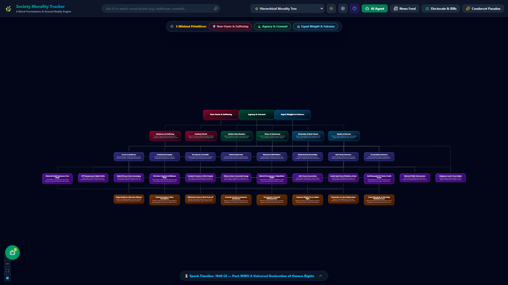
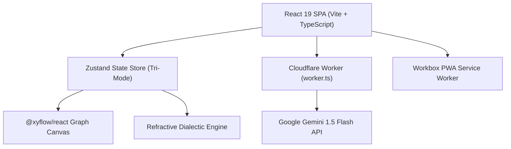

# 🏛️ Society Morality Tracker

[](https://socrates-morality.spandanb790.workers.dev)
[](https://react.dev/)
[](https://www.typescriptlang.org/)
[](https://tailwindcss.com/)
[](https://opensource.org/licenses/MIT)

> **Interactive civic governance analysis and AI-powered ethical auditing platform.**  
> Visualize moral tensions across 34 foundational human principles, evaluate 26+ Indian Parliamentary Bills through 7 demographic lenses, cross-examine government spending against official CAG audit reports, and debate policy with an edge-deployed Socratic AI philosopher.

---

## 🌐 Live Application
- **Production Edge App**: [socrates-morality.spandanb790.workers.dev](https://socrates-morality.spandanb790.workers.dev)
- **GitHub Repository**: [thepermanenturl/SocietyMoralityTracker](https://github.com/thepermanenturl/SocietyMoralityTracker)

---

## 📸 Interface Preview



---

## ✨ Core Capabilities

### 1. 🌳 34-Node Hierarchical Morality Graph
- **6 Conceptual Layers**: From primitive sentient drives (Layer -1), Foundational Axioms (Layer 0: Harm Minimization, Sentient Worth, Golden Rule, Autonomy, Basic Needs, Equity), Derived Rights (Layer 1), to Applied Governance (Layer 2) and Complex Dilemmas (Layer 3).
- **Tri-Lens Perspective Modes**: Switch between *Moral Axioms*, *Action Directives*, and *Cognitive Psychology* lenses.
- **Dynamic Selection Shading**: Clicking any node or policy card illuminates its active derivation paths in glowing cyan while dimming irrelevant nodes.

### 2. 💎 Refractive Dialectic Prism View
- Bifurcates complex civic dilemmas into 4 competing ethical schools:
  - **Utilitarian**: Aggregate welfare optimization.
  - **Deontological**: Categorical duties and moral rules.
  - **Rights & Autonomy**: Individual sovereignty and consent.
  - **Justice & Equity**: Fair resource distribution and vulnerable protections.

### 3. 🤖 Edge-Native Socratic AI Agent
- Powered by Google Gemini 1.5 Flash and deployed as a serverless Cloudflare Worker (`/api/chat`).
- Conducts multi-turn dialectical cross-examinations, interrogating user assumptions against foundational axioms without partisan bias.

### 4. 📊 Government Scheme Scorecard & CAG Audits
- Real-time audit dashboard comparing stated ministry objectives against empirical Comptroller and Auditor General (CAG) findings.
- Calculates fiscal divergence and beneficiary reach metrics for major welfare programs.

### 5. 📜 Legislative Demographic Impact Matrix
- Cross-analyzes 26+ Parliamentary Bills against 7 distinct demographic cohorts (Urban Middle Class, Smallholder Farmers, Women/Caregivers, Daily Wage Workers, Tech/Gig Economy, Tribal/Forest Communities, MSME Owners).
- Visualizes moral tension vectors and disparate impact indices.

### 6. 📱 Progressive Web App (PWA)
- Full mobile support with dedicated touch-ergonomic 5-tab navigation (Tree, Schemes, Prism, News, Socrates).
- Offline service worker caching via Workbox and automatic asset precaching.

### 7. 🧩 Portable AI Skill Package (`morality_tree_skills_package.json`)
- One-click export of the 34-node schema and 4 Socratic skills (`/navigate`, `/tutor`, `/dilemma`, `/audit`) to equip any LLM (Claude, ChatGPT, Ollama, Qwen).

---

## 🏗️ Architecture



---

## 🛠️ Tech Stack

| Layer | Technology |
|:------|:-----------|
| **Frontend Framework** | React 19.0.0, TypeScript 5.7.3, Vite 6.1.1 |
| **Styling & Design System** | Tailwind CSS v4.0.7 (Vedic Slate Palette), Lucide React Icons |
| **Interactive Graph Canvas** | @xyflow/react (ReactFlow 12.4.2) |
| **State Management** | Zustand 5.0.3 (Local / Cloud / Offline Tri-Mode) |
| **Interactive Onboarding** | Driver.js 1.8.0 |
| **PWA & Offline Engine** | Vite Plugin PWA 1.3.0, Workbox |
| **Edge Infrastructure** | Cloudflare Workers, Wrangler 3.114 |
| **AI Reasoning** | Gemini 1.5 Flash Edge Gateway |

---

## 🚀 Getting Started

### Prerequisites
- Node.js 20.x or higher
- npm 10.x or higher

### Local Development
```bash
# 1. Clone repository
git clone https://github.com/thepermanenturl/SocietyMoralityTracker.git
cd SocietyMoralityTracker

# 2. Install dependencies
npm install

# 3. Start local development server (Port 3000)
npm run dev
```

Open [http://localhost:3000](http://localhost:3000) in your browser.

### Production Build
```bash
npm run build
```

---

## ☁️ Deployment & CI/CD

### Automated Deployment (GitHub Actions)
Pushes to the `main` branch automatically trigger two parallel workflows:
1. **Cloudflare Workers Deployment** (`.github/workflows/deploy-worker.yml`): Builds and deploys the production edge bundle.
2. **GitHub Pages Deployment** (`.github/workflows/deploy.yml`): Static SPA fallback mirror.

### Manual Cloudflare Deployment
```bash
# Set production Gemini API Key secret
npx wrangler secret put GEMINI_API_KEY

# Deploy to Cloudflare Workers
npm run build
npx wrangler deploy
```

---

## 📄 License
This project is licensed under the [MIT License](LICENSE).
