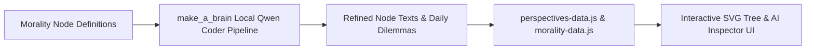

# Project Recommendations: makeMoralityTrackable

This document logs cross-project integration ideas, recommendations, architectural enhancements, and local model workflows for `makeMoralityTrackable`.

---

## 1. Local Model Node Text & Workflow Processing Pipeline (`make_a_brain` Integration)

### 📌 Proposal Summary
Set up an offline background batch pipeline where the local **Qwen 2.5 1.5B/7B Coder** model hosted on `make_a_brain` (`http://127.0.0.1:8000` / proxy `8086`) processes all 34 Morality Tree nodes (`A1-A6`, `D1-D8`, `E1-E12`, `X1-X8`).

### 🎯 Objectives
1. **Engaging Node Descriptions**: Generate punchy, intuitive summaries for each moral node to maximize user engagement.
2. **Interactive Daily Dilemmas**: Generate relatable everyday decision scenarios for every node, clarifying how applying the moral node removes decision friction.
3. **Multi-Perspective Enrichment**: Automatically refine Indian Constitutional promises, lived human stories (Modern Buddha), and government critic comparisons across all nodes without consuming cloud API credits.

### 🔄 Execution Flow

### 📋 Prerequisites & Compliance
- **Zero Cloud Credits**: Uses local port `8086` router (`coder`, `lbrain`, `local` keywords).
- **Cross-Project Isolation**: Executed strictly via local HTTP API payloads without directly mutating external directories without authorization.

---

## 2. Dynamic Real-Time Governance News Feed Synergy (`make_a_sense` Integration)

### 📌 Proposal Summary
Connect `makeMoralityTrackable` directly to `make_a_sense` (`http://127.0.0.1:8001`) REST endpoints to dynamically pull real-time governance acts, policy news, and media trust scores directly into the `#news-feed-drawer`.

### 🎯 Key Enhancements
- Interactive 1-tap `.clickable-node-chip` buttons for all broken moral axioms under `🚨 Broken Moral Axioms & Principles`.
- Automatic node highlight on main SVG canvas when examining news task details.
